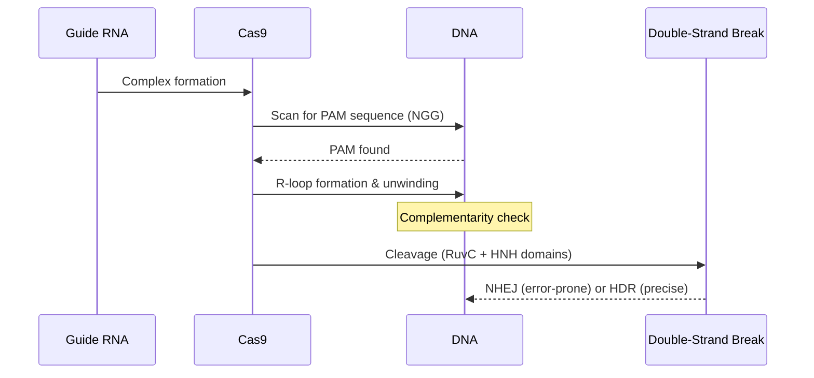
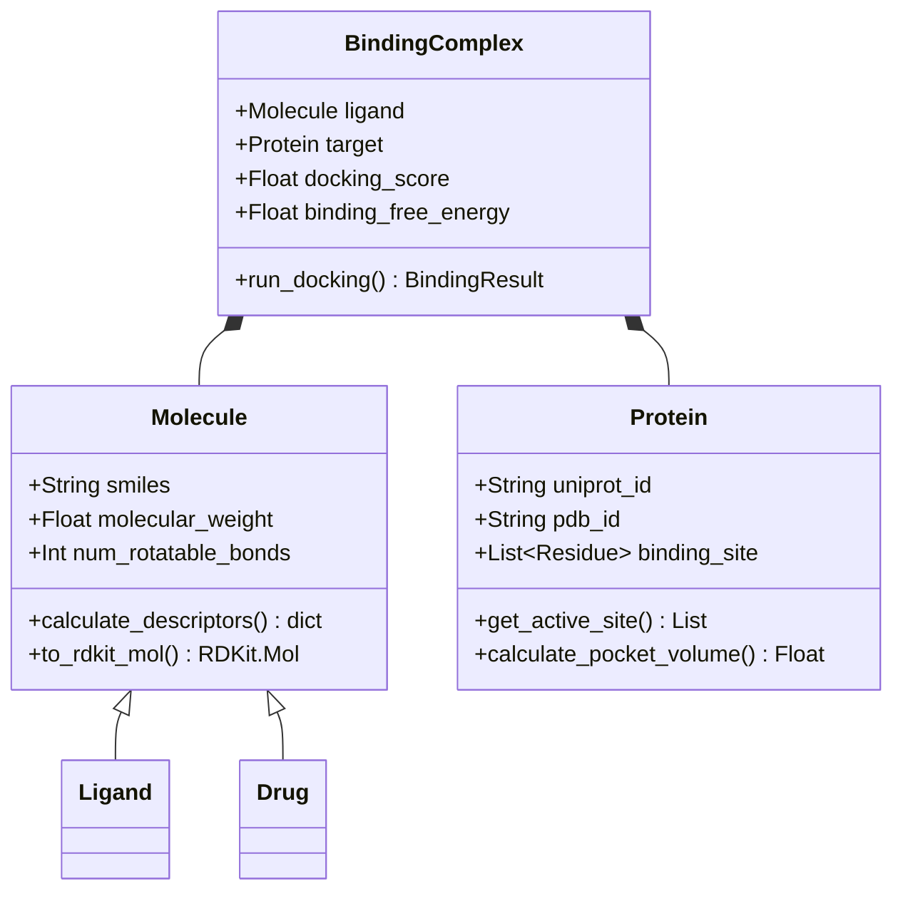
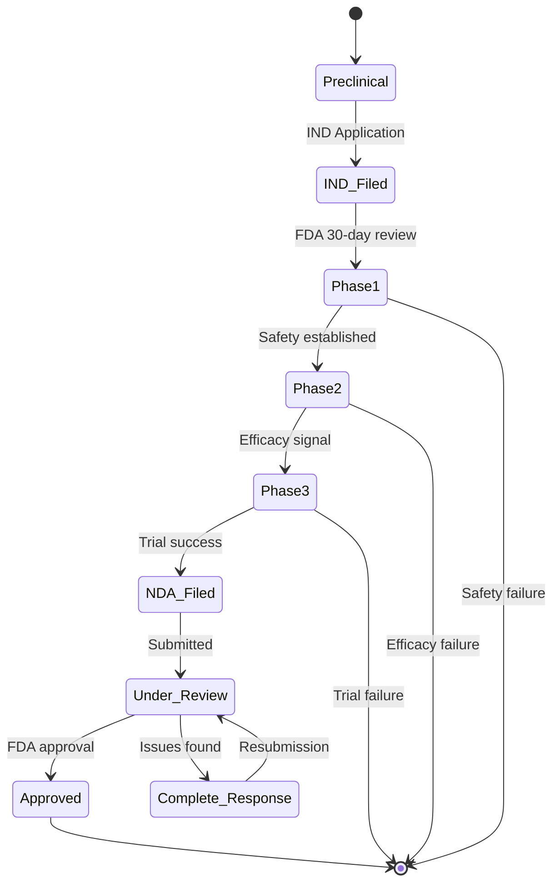

```mermaid
flowchart LR
    accTitle: Drug Discovery Pipeline
    accDescr: High-throughput screening to clinical trial workflow

    HTS[High-Throughput Screening\n100,000+ compounds] --> Hit[Hit Identification\n~1,000 hits]
    Hit --> Lead[Lead Optimization\n~100 leads]
    Lead --> Candidate[Drug Candidate\n1-5 compounds]
    Candidate --> IND[IND Filing]
    IND --> Phase1[Phase I Trial\nSafety, n=20-100]
    Phase1 --> Phase2[Phase II Trial\nEfficacy, n=100-300]
    Phase2 --> Phase3[Phase III Trial\nn=1,000-3,000]
    Phase3 --> NDA[NDA/BLA Submission]

    classDef preclinical fill:#e8f4f8,stroke:#2980b9
    classDef clinical fill:#eafaf1,stroke:#27ae60
    classDef regulatory fill:#fef9e7,stroke:#f39c12

    class HTS,Hit,Lead,Candidate preclinical
    class Phase1,Phase2,Phase3 clinical
    class IND,NDA regulatory
```

# Markdown + Mermaid Writing

Create scientific documentation with Mermaid diagrams embedded in Markdown. Renders natively on GitHub, GitLab, Notion, Obsidian, and VS Code without build steps.

## Supported Diagram Types (24)

| Category | Types |
|----------|-------|
| Flow | `flowchart`, `graph` |
| Sequence | `sequenceDiagram` |
| Class | `classDiagram` |
| State | `stateDiagram-v2` |
| Entity | `erDiagram` |
| Gantt | `gantt` |
| Pie | `pie` |
| Git | `gitGraph` |
| Mindmap | `mindmap` |
| Timeline | `timeline` |
| Quadrant | `quadrantChart` |
| XY | `xychart-beta` |
| Block | `block-beta` |
| Sankey | `sankey-beta` |
| Packet | `packet-beta` |
| Architecture | `architecture-beta` |
| + more | `journey`, `requirementDiagram`, `zenuml`, etc. |

## Standards (Required)

```markdown
graph TD
    accTitle: Protein Folding Pathway
    accDescr: Shows the sequential steps from unfolded to native state

    A[Unfolded Polypeptide] --> B[Molten Globule]
    B --> C[Native State]
```

**Always include:**
- `accTitle:` — accessibility title (screen readers, SEO)
- `accDescr:` — accessibility description

**Never use:**
- `%%{init: {...}}%%` directives (breaks many renderers)
- `classDef` with inline `style` (use `classDef` declarations at end instead)

## Flowcharts

```markdown

```

## Sequence Diagrams

```markdown

```

## Class Diagrams for Data Models

```markdown

```

## State Diagrams

```markdown

```

## Scientific Document Template

```markdown
# Research Finding: [Title]

## Overview

Brief context paragraph.

## Experimental Design

```mermaid
flowchart TD
    accTitle: [Experiment Name]
    accDescr: [What this diagram shows]

    [Your diagram here]
```

## Results

### Pathway Analysis

```mermaid
graph LR
    accTitle: [Pathway Name]
    accDescr: [Description]

    [Your diagram here]
```

## Data Flow

```mermaid
sequenceDiagram
    accTitle: Analysis Pipeline
    accDescr: Data processing steps

    [Your sequence here]
```
```

## Rendering Environments

| Platform | Rendering | Notes |
|----------|-----------|-------|
| GitHub | Native | `.md` files in repos |
| GitLab | Native | Docs and wikis |
| Notion | Native | Paste as code block → Mermaid |
| Obsidian | Plugin | Install "Mermaid" community plugin |
| VS Code | Extension | "Markdown Preview Mermaid Support" |
| Jupyter | `%%mermaid` magic | With appropriate extension |
| mkdocs | Plugin | `mkdocs-mermaid2-plugin` |

## Common Mistakes

| Problem | Fix |
|---------|-----|
| Diagram not rendering | Check for `%%{init}%%` directives and remove |
| Special chars break parse | Wrap node labels in `"quotes"` |
| `classDef` not applying | Declare at bottom, use `class NodeA className` |
| Missing accessibility | Add `accTitle:` and `accDescr:` after diagram type |
| Arrows wrong direction | `-->` is forward; `<--` is backward; `<-->` bidirectional |
| Subgraph issues | Ensure `end` keyword closes each `subgraph` |
